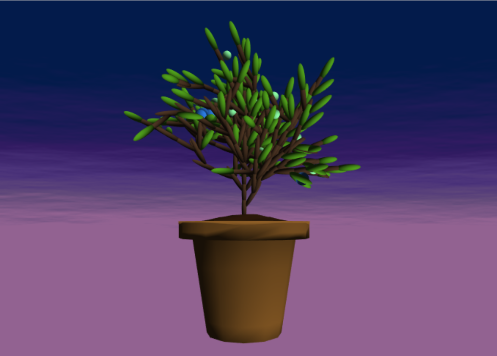
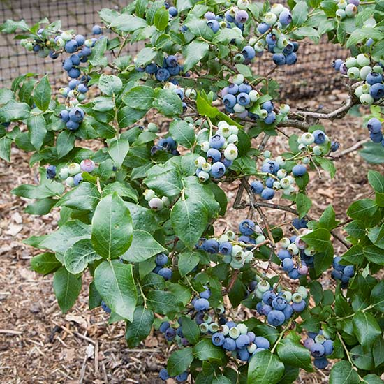
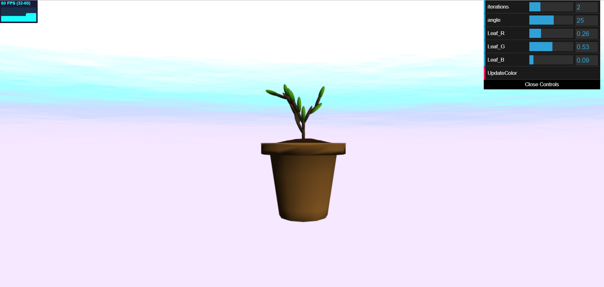
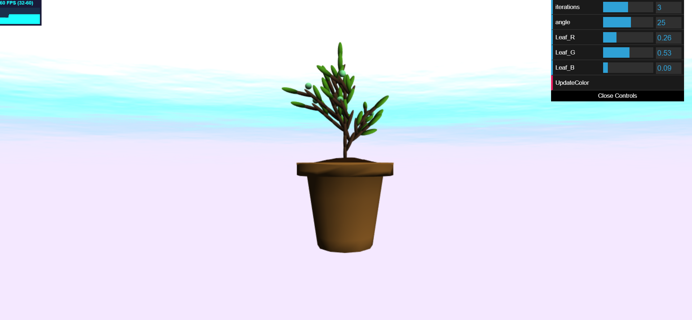
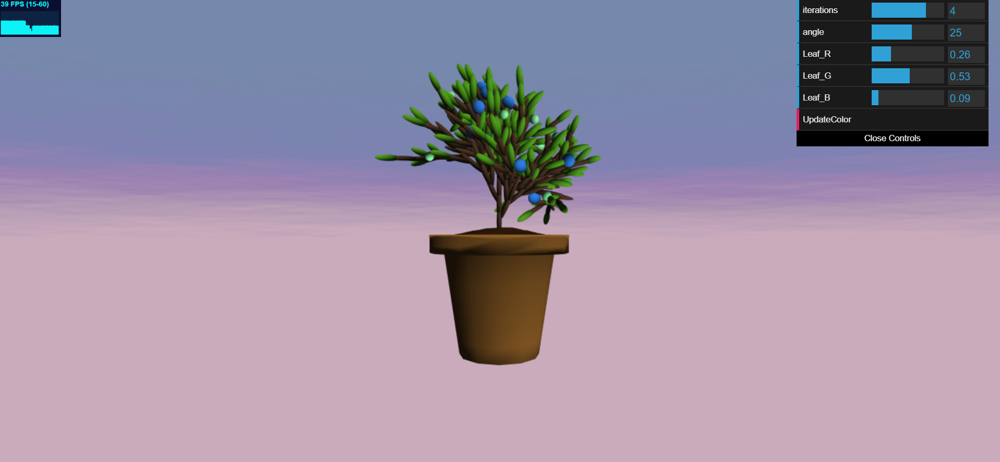
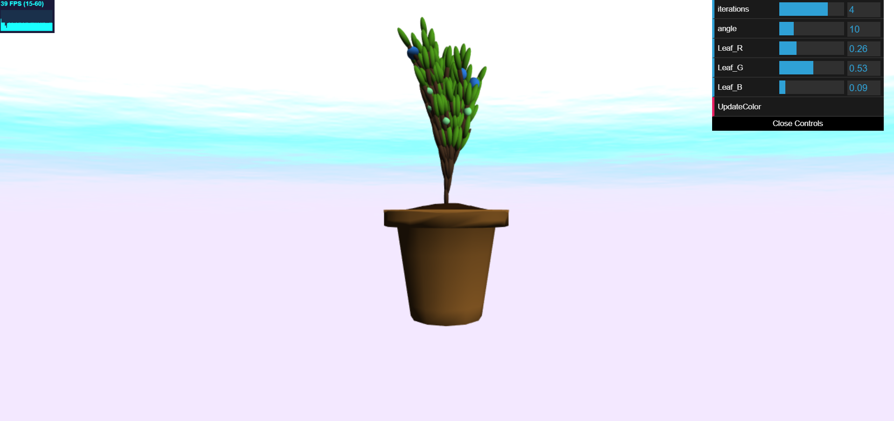
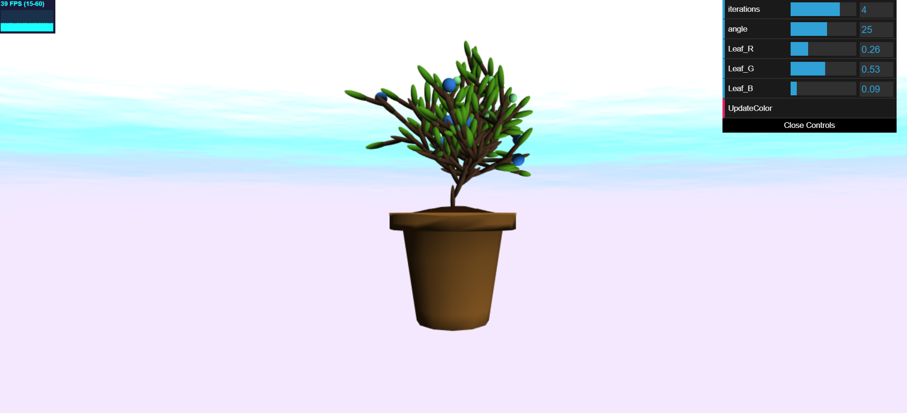
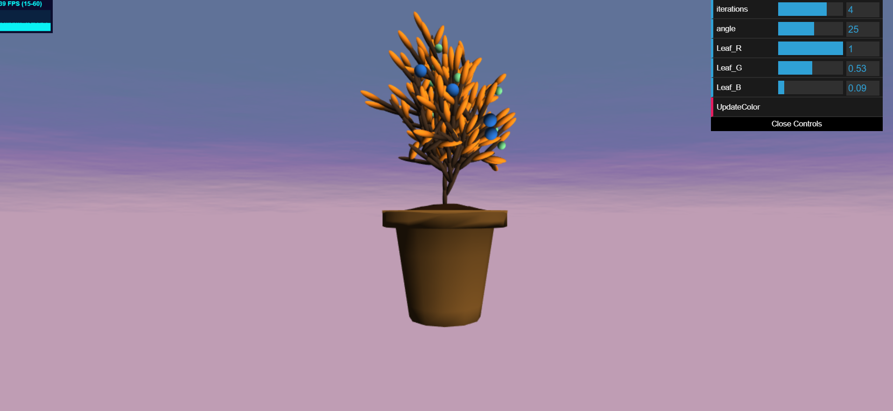
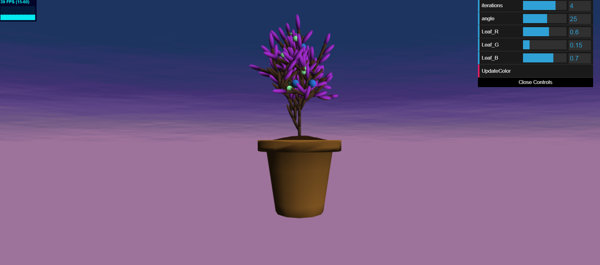

# Homework 4: L-systems

## Erin Goldberg
pennKey: engold

Link: https://engold.github.io/hw04-l-systems/

Inspiration Image

## References
- LSystem visualization tool: http://www.kevs3d.co.uk/dev/lsystems/ 
- LSystem Lecture Slides: https://cis700-procedural-graphics.github.io/files/lsystems_1_31_17.pd

- The scene updates/regenerates automatically when the gui sliders for iterations or angle size are changed. The three sliders for Leaf Color can be moved and set, but the scene will not update until the UpdateColor button (underneath the sliders) is pressed.

## L-System Classes
- Turtle
  - Keeps track of the position, orientation, quaternion for rotation, and recursion depth.
- ExpansionRules
  - Includes the axiom, the starting string from which the grammar is expanded.
  - Includes mappings of characters to other charcters. This uses a Map<string, Map<number, any>>, where the string is the character, and the second map is for the probablility and corresponding expansion function (which just replaces the existing character with a new string). A single character can map to different strings based on the designated probability.
- L-System 
  - Includes a Turtle to "draw" as it moves and rotates according to the associated drawing functions for each character as the grammar string is read.
  - Includes a Turtle History array (treated as a stack) to save/restore the states of turtles.
  - Includes Expanion Rules: mappings of what a character becomes in the next iteration as it's expanded. 
  - Includes Drawing Rules: functions to apply to the Turtle to draw the Lsystem.
  
- Instance rendering is used for all of the plant geometry. The pot and dirt were modeled in Maya and then read in from an obj loader. 

## L-System attributes
  - plant grows in 3D. There is some probalility that rotations will happen either on the Z-axis or on the Y-axis to ensure variation in how branches grow. 
  - At the end of every branch there is the possibility of there either being a leaf, a blue berry, or a tiny unripe berry. Leaves have the highest probablility of appearing: 65%, followed by blue berries with a 25% chance, and little green berries with a 10% chance.
  -  Using randomness to decide which axes to rotate on as well as utilizing different probalilities in which drawing functions are chosen and which expansion rules are used in order to create output that looks organic/random as seen in nature.
  - The backdrop is a cloudy sky horizon that changes from day to night and incorporates fbm noise.

## GUI
- Interactive aspects
  - number of iterations for the Lsystem
    
    
    

  - tunable angle of rotation for the branches
    
    

  - Leaf color
    
    

